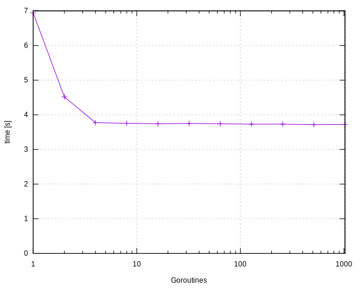

# Chapter 08, exercise 5

Timing as a function of the number of goroutines, for an image of 5000 by 5000
pixels:

| Goroutines | Time     |
| ---------: | -------: |
|          1 | 0m6.941s |
|          2 | 0m4.517s |
|          4 | 0m3.772s |
|          8 | 0m3.756s |
|         16 | 0m3.741s |
|         32 | 0m3.752s |
|         64 | 0m3.741s |
|        128 | 0m3.729s |
|        256 | 0m3.731s |
|        512 | 0m3.718s |
|       1024 | 0m3.723s |

