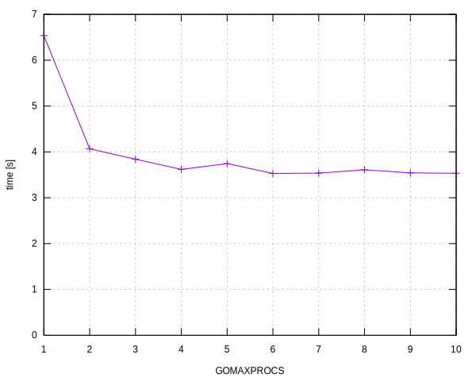

# Chapter 09, exercise 6

Using this shell script:

```sh
go build github.com/bewuethr/gopl/chapter08/ch08ex05

for p in {1..10}; do
    export TIMEFORMAT="| $p | %Rs |"
    time GOMAXPROCS=$p ./ch08ex05 -P 32 > /dev/null
done
```

to run the parallel Mandelbrot program from [Chapter 08, exercise 5][1] with 32
goroutines and a value of `GOMAXPROCS` between 1 and 10.

[1]: ../../chapter08/ch08ex05

The number of CPUs on this machine is 4. Results:

| `GOMAXPROCS` | Time   |
| -----------: | -----: |
|            1 | 6.537s |
|            2 | 4.067s |
|            3 | 3.840s |
|            4 | 3.619s |
|            5 | 3.745s |
|            6 | 3.531s |
|            7 | 3.538s |
|            8 | 3.610s |
|            9 | 3.543s |
|           10 | 3.534s |


